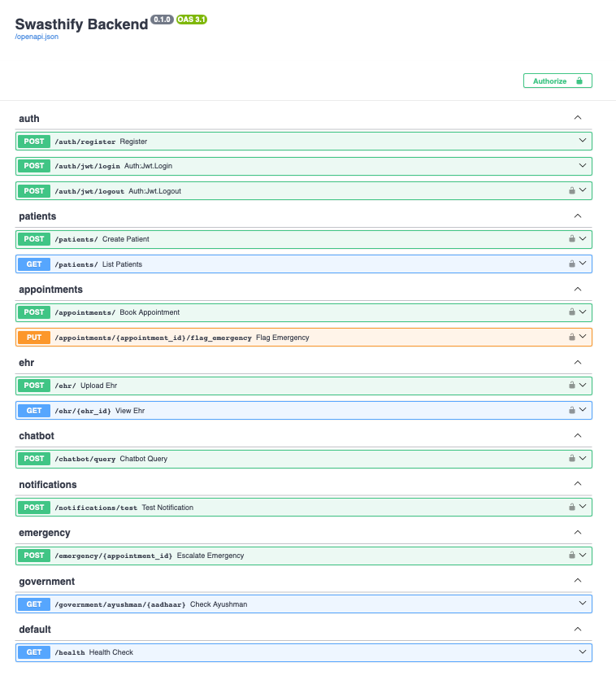

# Digital Health Platform
An AI-powered digital healthcare platform that connects patients and doctors, enables electronic health record (EHR) uploads, appointment booking, chatbot-based health assistance, and emergency handling with government scheme integration.

### Documentation of our API
## url: http://localhost:8000/docs

### Technology:
- Python
- FastAPI
- PostgreSQL
- Redis
- Docker
- Kubernetes
- AI
- JWT Authentication

### Copyright
@cs-joy
#sj

